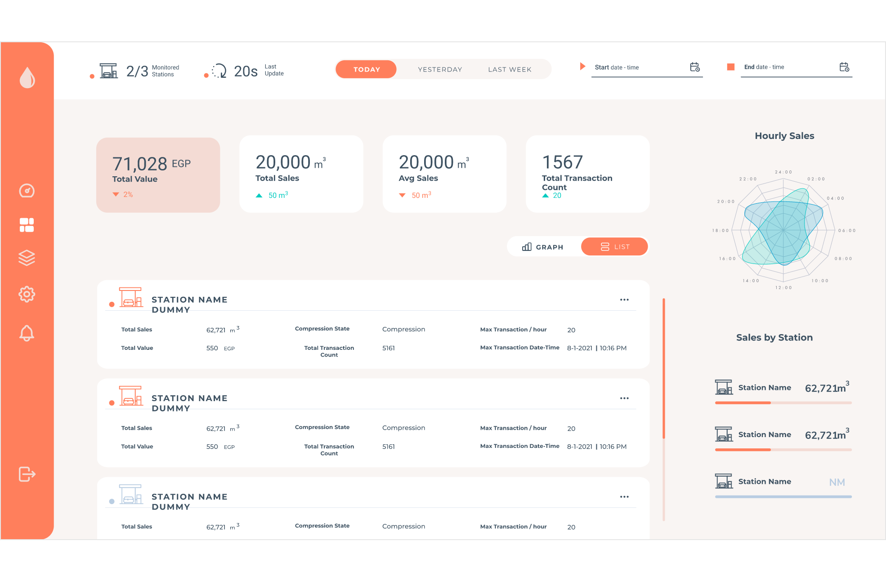

# Angular Dashboard





## Description

Angular Dashboard is a market sales tracking dashboard built from scratch. It provides clean and efficient code for tracking market sales using Chart.js for data visualization.

## Features

- Clean and well-organized codebase
- Integration with Chart.js for data visualization
- Easy installation and setup

## Installation

To run this Angular Dashboard locally, follow these steps:

1. Clone the repository to your local machine:

   ```shell
   git clone https://github.com/yourusername/angular-dashboard.git
